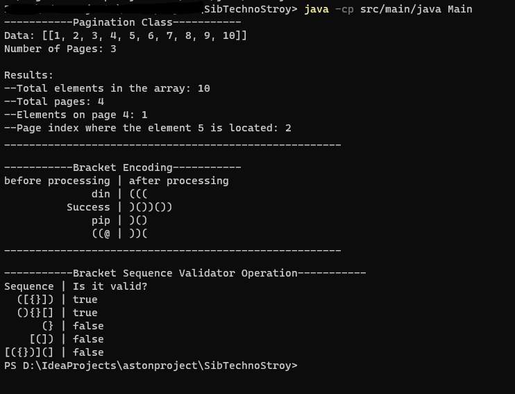

##Структура проекта
````
???src
    ????main
    ?   ????java
    ?   ?   ????brackets
    ?   ?   ????helper
    ?   ????resources
    ????test
        ????java
````

##Brackets Static Utilities
Пакет brackets содержит утилитарные методы для работы со скобками.

BracketsStaticUtils
* __bracketEncoding(String s)__
Метод bracketEncoding принимает строку s и возвращает закодированную строку, заменяя скобки на символы '(' или ')', в зависимости от количества каждого типа скобок в строке.

* __bracketSequenceValidator(String s)__
Метод bracketSequenceValidator проверяет строку s на корректность последовательности скобок. Он возвращает true, если последовательность скобок в строке правильно сбалансирована и false в противном случае.

##Pagination Helper
Пакет helper содержит класс PaginationHelper для работы с пагинацией данных.

PaginationHelper<T>
Методы:
* __itemCount()__: Возвращает количество элементов в списке данных.
* __pageCount()__: Возвращает количество страниц, на которые можно разбить данные с учетом числа элементов на странице.
* __pageItemCount(int pageIndex)__: Возвращает количество элементов на указанной странице (pageIndex) или -1, если страница не существует.
* __pageIndex(int itemIndex)__: Возвращает индекс страницы, на которой расположен элемент с индексом itemIndex или -1, если элемент не существует.

##Tests
Классы тестов находятся в директории test/java

##Инструкция по запуску
###1. Установка Java
Прежде всего, убедитесь, что на вашем компьютере установлена Java. Если нет, нужно установить Java Development Kit (JDK). Можно скачать JDK с официального сайта Oracle или воспользоваться другими источниками.
   
Следуйте инструкциям на сайте Oracle для загрузки и установки JDK в вашу операционную систему (Windows, macOS, Linux).
После установки JDK можно проверить его наличие, открыв терминал (на Windows - командную строку) и введя команду java -version. Если Java установлена правильно, вы увидите информацию о версии Java.

###2. Склонируйте проект:
``git clone ``

###3. Скомпилируйте файлы с расширением .java:
``javac src/main/java/brackets/BracketsStaticUtils.java src/main/java/helper/PaginationHelper.java src/main/java/Main.java``
###4. Запустите программу:
``java -cp src/main/java Main``

Результат выполнения вы увидете в консоли:


###5. Альтернативный запуск:
Если у вас установлена среда разработки IntelliJ IDEA, то открыв проект просто прогнать тесты:
``mvn clean install``
и в классе Main.java поизменять данные